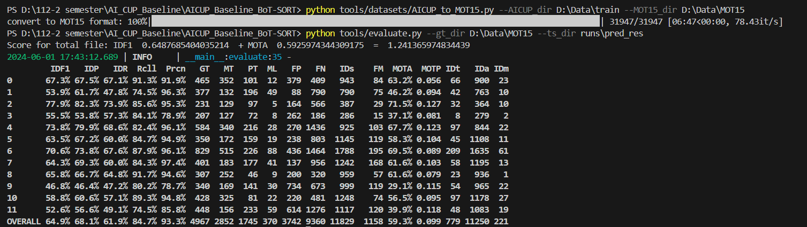

# AICUP Baseline: BoT-SORT ML_10
The code is based on [AICUP_Baseline_BoT-SORT](https://github.com/ricky-696/AICUP_Baseline_BoT-SORT)

## Installation

**The code is tested on Windows 11**

## Setup with Conda
**Step 1.** Create Conda environment and install pytorch
```shell
conda create -n botsort python=3.7
cond activate botsort
```
**Step 2.** Install torch and match torchvision from [pytorch.org](https://pytorch.org/get-started/previous-versions/).<br>
The code is tested using torch 1.13.1+cu117 and torchvision=0.14.1+cu117

**Step 3.** **Install numpy first**
```shell
pip install numpy
```

**Step 4.** Install [pytorch=1.13.1+cu117](https://pytorch.org/get-started/previous-versions/)
```shell
pip install torch==1.13.1+cu117 torchvision==0.14.1+cu117 torchaudio==0.13.1 --extra-index-url https://download.pytorch.org/whl/cu117
```

**Step 5.** Install 'requirements.txt'
```shell
cd <AICUP_Baseline_BoT-SORT>

pip install -r 'requirements.txt'
```

**Step 6.** Install cython
```shell
pip install cython
```

**Step 7.** Install [pycocotools](https://github.com/cocodataset/cocoapi/blob/master/PythonAPI/pycocotools/coco.py)
```shell
pip install pycocotools
```

**Step 8.** Install cython_bbox & faiss-cpu
```shell
# Cython-bbox
pip install cython_bbox

# faiss-cpu
pip install faiss-cpu
```

## Prepare ReID Dataset

For training the ReID , detection patches must be generated as follows:

```shell
# For AICUP
python fast_reid/datasets/generate_AICUP_patches.py --data_path D:\Data\train

# remember link dataset to FastReID
set FASTREID_DATASETS=fast_reid\datasets
```
>[!TIP]
>+ Since we previously changed the directory to `AICUP_Baseline_BoT-SORT`, 
> the `FASTREID_DATASETS=fast_reid\datasets` should be set as a relative path.
>+ In the [AICUP_Baseline_BoT-SORT](https://github.com/ricky-696/AICUP_Baseline_BoT-SORT)
> use ```export FASTREID_DATASETS=fast_reid\datasets```, but Windows don't have 'export'
>command, to translate linux style command scipt to windows/command batch style it would go like this:
>```shell
>set FASTREID_DATASETS=fast_reid\datasets
>```

## Prepare YOLOv7 Dataset
run the `yolov7/tools/AICUP_to_YOLOv7.py` by the following command:

```shell
cd <AICUP_Baseline_BoT-SORT>
python yolov7/tools/AICUP_to_YOLOv7.py --AICUP_dir D:\Data\train --YOLOv7_dir D:\Data\yolo
```
## Model Zoo for COCO
>[!TIP]
> We recommand using YOLOv7 as the object detection model for tracking

Download and store the trained models in 'pretrained' folder as follows:
```shell
<BoT-SORT_dir>/pretrained
```

+ For multi-class MOT use [YOLOv7](https://github.com/WongKinYiu/yolov7) trained on COCO(or any custom weights)
+ This project we download [**YOLOv7-E6E**](https://github.com/WongKinYiu/yolov7/releases/download/v0.1/yolov7-e6e.pt)

## Training  (Fine-tuning)

### Train the ReID Module for AICUP ###

After generating the AICUP ReID dataset as descibed in the 'Data Prepareation' section.
```shell
cd <AICUP_Baseline_BoT-SORT>

# For training AICUP
python fast_reid/tools/train_net.py --config-file fast_reid\configs\AICUP\bagtricks_R50-ibn.yml MODEL.DEVICE "cuda:0"
```

### Fine-tune YOLOv7 for AICUP ###

- The dataset path is configured in [yolov7/data/AICUP.yaml](./yolov7/data/AICUP.yaml).
- The model architecture can be configured in [yolov7/cfg/training/yolov7-AICUP.yaml](./yolov7/cfg/training/yolov7-AICUP.yaml).
- Training hyperparameters are configured in [yolov7/data/hyp.scratch.custom.yaml](./yolov7/data/hyp.scratch.custom.yaml).

> [!Warning]
> - Due to hardware limitations, we are using yolov7-e6e.pt as the tracking model weights.
> - Therefore, this step will not be used in this project.

Single GPU finetuning for AICUP dataset
```shell
cd <AICUP_Baseline_BoT-SORT>

# finetune p5 models
python yolov7/train.py --device 0 --batch-size 1 --epochs 5 --data yolov7/data/AICUP.yaml --img 1280 1280 --cfg yolov7/cfg/training/yolov7-AICUP.yaml --weights 'pretrained/yolov7-e6e.pt' --name yolov7-AICUP --hyp data/hyp.scratch.custom.yaml
```

The training results wil be saved by default at `runs/train`.

## Tracking and creating the submission file for AICUP (Demo)

Track one `<timestamp>` with BoT-SORT(ReID) based YOLOv7 and multi-class (We only output class: 'car')
```shell
cd <AICUP_Baseline_BoT-SORT>
python tools/mc_demo_yolov7.py --weights pretrained/yolov7-e6e.pt --source AI_CUP_MCMOT_dataset/train/images/<timestamp> --device "0" --name "<timestamp>" --fuse-score --agnostic-nms --with-reid --fast-reid-config fast_reid/configs/AICUP/bagtricks_R50-ibn.yml --fast-reid-weights logs/AICUP/bagtricks_R50-ibn/model_00xx.pth
```
The submission file and visualized images will be saved by default at `runs/detect/<timestamp>`.

## Evaluation format ##

The evaluation format is the same as [py-motmetrics](https://github.com/cheind/py-motmetrics)

## Evaluate your submission

Before evaluation, you need to run `tools/datasets/AICUP_to_MOT15.py` to convert ground truth into submission format:

```bash
cd <AICUP_Baseline_BoT-SORT>
python tools/datasets/AICUP_to_MOT15.py --AICUP_dir D:\Data\train --MOT15_dir D:\Data\yolo
```

You can use `tools/evaluate.py` to evaluate your submission by the following command:

```bash
cd <AICUP_Baseline_BoT-SORT>
python tools/evaluate.py --gt_dir D:\Data\MOT15 --ts_dir runs\pred_res
```

Then you can get the result:


## Tracking and creating the submission file for AICUP (testdatasets) 

